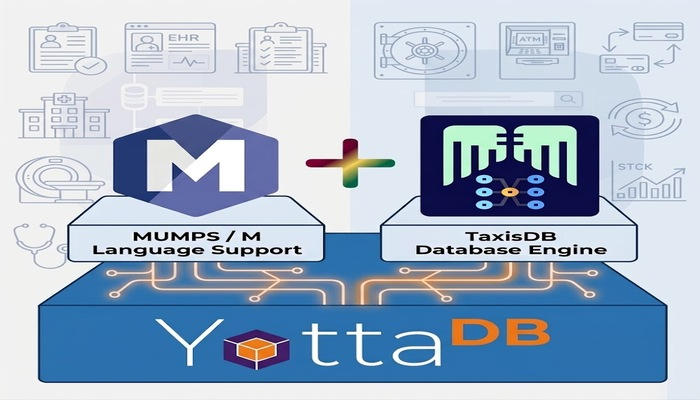

## Welcome to TaxisDB 👋

[TaxisDB](https://taxisdb.com) is a metamodel-driven, reflective, temporal, immutable, triple-oriented database engine implemented on top of [YottaDB](https://yottadb.com/). See also the sister project [HermesBase-TaxisBase](https://taxisdb.com/projects/hermes-base) at the official web site of TaxisDB.

TaxisDB treats both domain triples and the model that describes those triples as first-class data. Rather than representing information primarily as mutable rows or documents, it represents changes as immutable assertions and preserves their transaction history.

TaxisDB is built on a few core ideas:

- **Temporal** — transaction time is a first-class dimension, so historical database states can be reconstructed.
- **Immutable** — triples are asserted, not overwritten; history is part of the database rather than an external audit log.
- **Triple-oriented** — the base unit of information is an EATV-style triple rather than a mutable row or document.
- **Reflective & metamodel-driven** — the model itself (types, attributes, constraints) is represented as data and can be introspected at runtime.
- **Built on YottaDB** — durable storage, ACID transactions, concurrency, journaling, recovery, and replication are delegated to YottaDB's serverless, in-process architecture, leaving TaxisDB free to focus on logical database semantics.

For the full architectural write-up see [TaxisDB project page](https://taxisdb.com/projects/taxis-db/). For a deeper look at the ideas behind TaxisDB and substrate architecture, read our article [Every Database Had Its Own Storage Engine — Then Came Substrate Architecture.](https://taxisdb.com/posts/every-database-had-its-own-storage-engine-then-came-substrate-architecture/)

## TaxisDB License at a Glance

TaxisDB is an open source project. The [TaxisDB License at a Glance](https://taxisdb.com/docs/taxis-db-license-at-a-glance) document explains how the SSPL license is applied to TaxisDB. For more information, visit the [License Documentation section](https://taxisdb.com/docs/#category-license) at the official TaxisDB website. The project [HermesBase-TaxisBase](https://taxisdb.com/projects/hermes-base/) is governed by a different licence. Read [TaxisBase License At a Glance](https://taxisdb.com/docs/taxis-base-license-at-a-glance/) to understand the difference.

## What should I visit next?
For the complete set of architectural documentation, API guides, and TaxisBase documentation, visit the official [TaxisDB website documentation](https://taxisdb.com/docs/) that includes:
- [Installation and First Run](https://taxisdb.com/docs/installation-and-first-run/) — install TaxisDB and run the database for the first time.
- [TaxisBase: The Database of TaxisDB](https://taxisdb.com/docs/taxis-base-the-database-of-taxis-db/) — the TaxisBase foundational schema: objects, associations, types, attributes, value types, and semantic modeling.
- [TBox Data Access API User Guide](https://taxisdb.com/docs/tbox-data-access-api-user-guide/) — access and work with TBox schema data.
- [ABox Data Access API User Guide](https://taxisdb.com/docs/abox-data-access-api-user-guide/) — access and work with ABox domain data.
- [Logger Data Access API User Guide](https://taxisdb.com/docs/logger-data-access-api-user-guide/) — TaxisDB logging and observability.

For developers visit:
- [Developer README](https://taxisdb.com/dev/) — A friendly piece of advice before you dive into the code
- [API Flow: Code](https://taxisdb.com/api-flow/code/) — the implementation-level API flow.
- [API Flow: Summary](https://taxisdb.com/api-flow/summary/) — a concise overview of the TaxisDB API architecture.

For database architects  and researchers in database field visit:
- [Every Database Had Its Own Storage Engine — Then Came Substrate Architecture.](https://taxisdb.com/posts/every-database-had-its-own-storage-engine-then-came-substrate-architecture/) — how a reusable transactional substrate can support substantially different database abstractions.