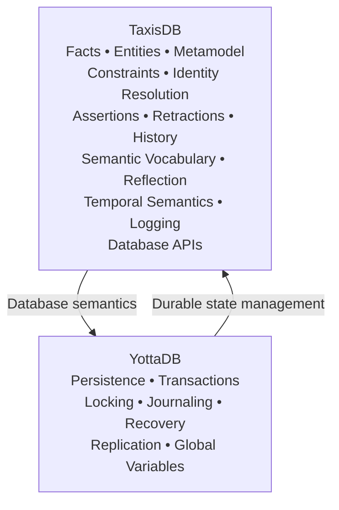
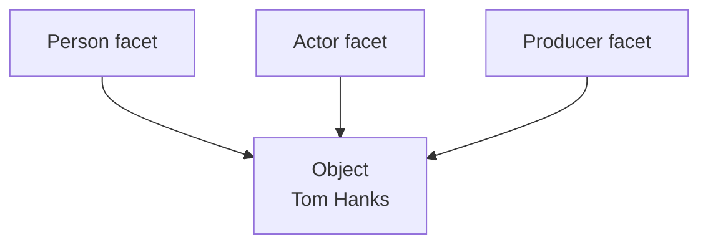
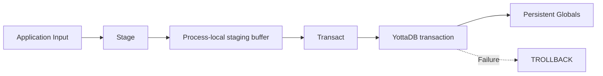
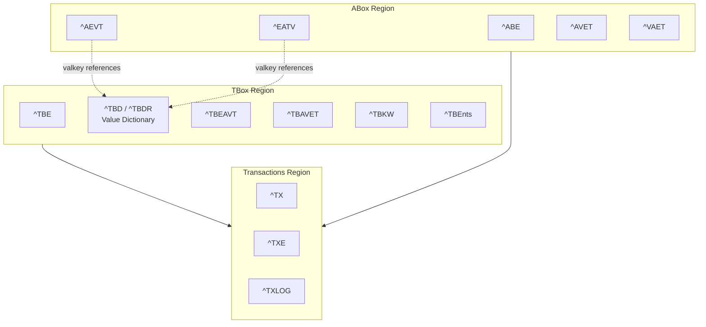
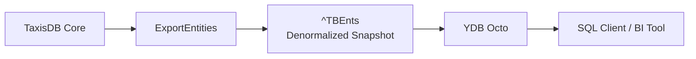
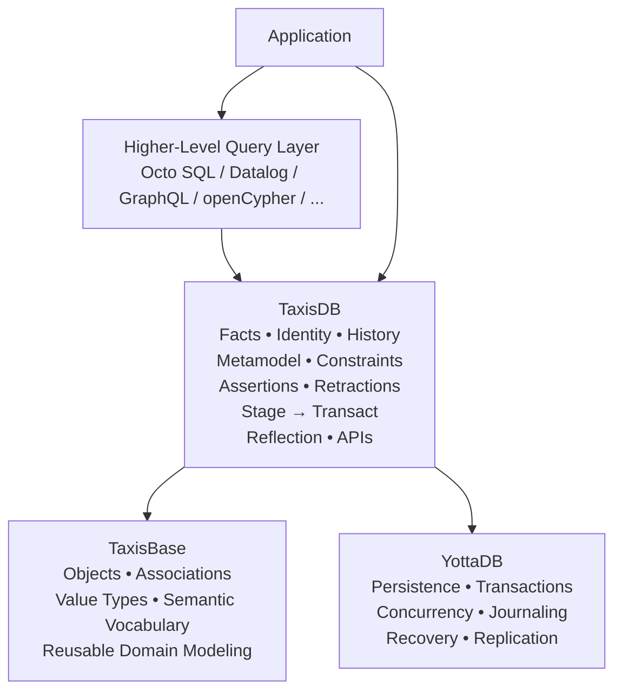

# TaxisDB

## Welcome to TaxisDB 👋

[](https://github.com/taxisdb/taxisdb)

TaxisDB is a metamodel-driven, reflective, temporal, immutable, fact-oriented database engine implemented on top of YottaDB.

TaxisDB treats both domain facts and the model that describes those facts as first-class data. Rather than representing information primarily as mutable rows or documents, TaxisDB represents changes as immutable assertions and preserves their transaction history.

Architecturally, TaxisDB combines three ideas:

```text
Immutable fact-oriented database
              +
Reflective metamodel and reusable schema
              +
YottaDB transactional substrate
```

The result is a database system in which facts, entities, schema, identity, constraints, and transaction history are part of one coherent model.

## Core Concepts

| Concept          | TaxisDB                                                                                                   |
| ---------------- | --------------------------------------------------------------------------------------------------------- |
| Temporal         | Facts retain transaction history and historical database state can be reconstructed                       |
| Immutable        | Existing facts are not overwritten; changes are represented through assertions and retractions            |
| Fact-Oriented    | The fundamental unit of information is a fact rather than a mutable row or document                       |
| Reflective       | The database model is represented as data and can be inspected programmatically                           |
| Metamodel-Driven | Types, attributes, relationships, and constraints are represented using the database's own primitives     |
| Semantic         | The model distinguishes entities, attributes, values, domains, ranges, references, and value dictionaries |
| Transactional    | Changes are prepared and committed through a two-phase Stage → Transact write path                        |
| Substrate-Based  | YottaDB supplies persistent storage, transactions, concurrency, recovery, and replication                 |
| API-Driven       | Database operations are exposed through TaxisDB data-access APIs                                          |

## TaxisDB: A Datomic-Style Database on YottaDB

TaxisDB is influenced by the immutable fact model associated with Datomic, but it is implemented using a fundamentally different substrate.

The important architectural idea is not that TaxisDB reproduces Datomic. It is that the logical database model can be separated from the storage substrate.

```text
TaxisDB                              YottaDB
 ├── Facts                            ├── Persistent storage
 ├── Immutability                     ├── Hierarchical globals
 ├── Temporal semantics               ├── Transactions
 ├── Identity                         ├── Concurrency control
 ├── Metamodel / reflection           ├── Journaling
 ├── Constraints                      ├── Recovery
 ├── Indexing                         └── Replication
 └── Database APIs
```

YottaDB provides mature transactional state management. TaxisDB defines the logical database semantics that operate on top of that state.

This demonstrates an important architectural proposition:

```text
Reusable transactional substrate
                +
New logical database model
                =
New database system
```

The same underlying YottaDB substrate can therefore support substantially different logical database abstractions. YDB Octo provides one example by exposing a relational/SQL model over YottaDB, while TaxisDB applies a fact-oriented, immutable, reflective model to the same class of substrate.

## Why YottaDB?

YottaDB is not simply being used as a generic key-value store.

Its architectural characteristics are directly relevant to TaxisDB:

* Hierarchical sparse globals
* Multidimensional subscripted storage
* Ordered key traversal
* ACID transactions
* Concurrency control
* Journaling and crash recovery
* Replication
* Multi-process access
* In-process, serverless database architecture

YottaDB is descended from the M/MUMPS database lineage and has decades of production history in demanding transactional environments.

Most importantly, TaxisDB does not need to reproduce the low-level mechanisms required for durable state management. YottaDB already provides those mechanisms, allowing TaxisDB to concentrate on facts, entities, metadata, temporal semantics, identity, constraints, and database APIs.



## Temporal Database

Time is a fundamental dimension of TaxisDB.

Facts are associated with transaction IDs, allowing the evolution of database state to be preserved and historical states to be reconstructed.

This enables:

* Historical reconstruction
* Audit history
* State evolution tracking
* Reproducibility of previous database states
* Time-based reasoning

TaxisDB currently implements transaction time:

* Transaction time is when the database records a fact.
* Valid time is when a fact is considered true in the modeled domain.

Valid time can be represented by the domain model where required.

A system that models both transaction time and valid time is generally described as bitemporal. TaxisDB currently provides the transaction-time dimension while leaving valid-time semantics to the application model.

## Immutable Facts

TaxisDB does not perform conventional in-place updates.

Facts are asserted and retracted. Existing facts remain available as historical information.

Conceptually:

```text
Entity → Attribute → Value → Transaction
```

The primary ABox representation is:

```text
^EATV(eid, aid, tx, valkey) = op
```

where `op` records whether the fact was asserted or retracted.

A change therefore adds historical information instead of silently replacing the previous state.

This provides:

* Complete history preservation
* Deterministic state reconstruction
* Explicit change history
* Non-destructive updates
* Stable entity identity

Immutability therefore does not mean that the database is static. It means that state changes are represented as new facts.

## Fact-Oriented Data Model

The fundamental unit of information is a fact.

The conceptual structure is:

```text
Entity
   ↓
Attribute
   ↓
Value
   ↓
Transaction
```

This places TaxisDB in the broader family of fact-oriented and EAV-inspired systems, while giving it its own storage, transaction, metamodel, and indexing semantics.

The primary ABox index is EATV:

```text
Entity → Attribute → Transaction → Value
```

Additional indexes provide attribute-oriented, value-oriented, and reverse-reference access.

Because transactions are explicit in the physical representation, the database can preserve not only what value an entity has, but how that state evolved through successive transactions.

## Reflective Database and Schema-as-Data

TaxisDB represents its own model as data.

Types, attributes, value types, enumerations, composite value types, associations, constraints, and other schema structures can be represented using the same underlying fact mechanisms used for domain data.

This makes TaxisDB reflective.

```text
                 TaxisDB
                    │
          ┌─────────┴─────────┐
          │                   │
      Model Data          Domain Data
          │                   │
     Types / Attributes    Objects / Facts
     Constraints           Associations
     Value Types            Values
```

The model is therefore not merely external configuration. It is itself part of the database's semantic data.

This enables:

* Runtime schema discovery
* Programmatic introspection
* Reflection over database structures
* Explicit model evolution
* Reusable schema vocabularies

The model and domain data remain conceptually distinct, but both are represented within the same overall database architecture.

## TBox and ABox

The distinction between model and instances can be expressed using the traditional TBox/ABox terminology.

### TBox

The TBox describes the model.

It contains concepts such as:

* Entity types
* Attributes
* Value types
* Enumerations
* Composite value types
* Constraints
* Schema metadata

### ABox

The ABox contains concrete instances and facts expressed using that model.

For example:

```text
TBox

Person
Gender
Geolocation
person.name
person.birthDate
```

can be used to describe:

```text
ABox

Alice
female
(-36.60664, -72.10344)
Alice's name
Alice's birth date
```

The distinction is important because model definitions and domain data have different roles and lifecycles.

TaxisDB preserves that conceptual separation while still treating the model itself as first-class database data.

## TaxisBase: A Freebase-Style Schema Above TaxisDB

TaxisBase is the reusable semantic schema layer built on top of TaxisDB.

It is not another storage engine and not a separate database implementation. It is a general-purpose vocabulary constructed using TaxisDB's metamodel and fact primitives.

Its design is influenced by Freebase, particularly:

* Multiple conceptual facets for an entity
* Composite and n-ary facts
* Reusable semantic vocabulary

TaxisBase introduces concepts including:

* Objects
* Associations
* Types
* Attributes
* Atomic value types
* Enumerated value types
* Composite value types
* Entity identity
* Attribute domains and ranges
* Value dictionaries

### Objects and Associations

An Object represents the underlying topic.

An Association describes that object from a particular perspective.



This allows one underlying object to participate in multiple independently modeled facets without forcing all characteristics into one rigid entity type.

### Composite Value Types

Some facts cannot be adequately represented as a single scalar value.

A geographic position, for example, may contain multiple related values:

```text
Geolocation
 ├── latitude
 ├── longitude
 └── altitude
```

TaxisBase represents such structures through Composite Value Types.

Associations similarly provide a mechanism for representing richer relationships whose meaning depends on multiple related facts.

This gives TaxisBase a Freebase-style approach to multi-faceted entities and complex relationships while retaining TaxisDB's own fact and transaction semantics.

Read more in the official TaxisBase documentation:

[TaxisBase: The Database of TaxisDB](https://taxisdb.com/docs/taxis-base-the-database-of-taxis-db/)

## Semantic Vocabulary

TaxisDB and TaxisBase distinguish several concepts that are commonly collapsed together in simpler database models.

An attribute has a:

```text
Domain
  ↓
Which kind of entity can carry the attribute?

Range
  ↓
What kind of value can it contain?

Value Domain / Dictionary
  ↓
Which concrete values have been registered?
```

For reference-valued attributes, the model can additionally constrain the entity type to which the reference must resolve.

This separates:

* The meaning of an attribute
* The entities to which it applies
* The type of value it accepts
* The type of entity a reference can identify
* The concrete values registered for that attribute

## Value Types

TaxisBase distinguishes three major categories of value type.

```text
Value Types
 ├── Atomic
 │    └── string, integer, date, reference, ...
 │
 ├── Enumerated
 │    └── closed sets of named values
 │
 └── Composite
      └── structured multi-field values
```

An attribute has a value type; it is not itself a value type.

For example:

```text
sandbox.movie.title
        │
        └── range → sys.val.string
```

The attribute provides semantic meaning, while `sys.val.string` defines the shape of the value.

## Attribute Metadata and Constraints

Attributes are themselves entities in the TaxisDB model.

An attribute can carry metadata describing:

* Its key
* Range
* Cardinality
* Uniqueness
* Required status
* Validation
* Reference target type
* Description
* Label
* Usage
* Examples
* Other schema metadata

This allows TaxisDB to distinguish structural metadata from descriptive metadata.

Structural metadata controls database behavior.

Descriptive metadata makes the model understandable to people and downstream tools.

## Value Dictionaries

TaxisDB uses attribute-specific value dictionaries to intern logical values.

The implemented mappings are:

```text
^TBD
    aid + valkey → literal

^TBDR
    aid + literal → valkey
```

A datom can therefore store a compact value key:

```text
^EATV(eid, aid, tx, valkey) = op
```

instead of repeatedly storing the literal representation.

The mapping is attribute-specific:

```text
attribute + value ↔ valkey
```

This supports:

* Value interning
* Deterministic value keys
* Reverse lookup
* Attribute-specific uniqueness checking
* Materialized value domains
* More compact datom representation

The dictionary physically resides in the TBox region but serves both TBox metadata attributes and ABox domain attributes.

### Future Canonical Literal Layer

The current implementation provides:

```text
fact
  ↓
attribute dictionary
  ↓
value
```

A possible future extension would introduce shared canonical literal storage:

```text
fact
  ↓
attribute dictionary
  ↓
canonical literal
```

This could allow common literal values to be stored once and referenced from multiple attribute dictionaries.

Such a design could also have implications for merging independently produced datasets by allowing equivalent literals to resolve to common canonical representations.

This is a proposed extension, not part of the current implementation.

## Stage → Transact

TaxisDB separates write preparation from durable commitment.



The Stage phase performs operations such as:

* Input interpretation
* Entity identity resolution
* Attribute resolution
* Value resolution
* Validation
* Conversion into assertions and retractions

The staged operations remain process-local until Transact is called.

Transact then performs the persistent operation inside a YottaDB transaction.

This provides a clean boundary:

```text
Stage
  ↓
interpretation + validation
  ↓
Transact
  ↓
atomic durable commit
```

The separation also allows multiple changes to be accumulated and committed as one transaction.

## Identity Resolution

TaxisDB supports several forms of entity identification.

```text
Raw EID
  ↓
Direct entity lookup

Attribute + Value
  ↓
Unique-attribute lookup

Human-readable Key
  ↓
Key resolution
```

Examples include:

```text
654f2564f8165hevmhe6
sandbox.dlc.id|042
obj.tom_hanks
```

The internal EID provides database identity, while human-readable keys provide stable handles for people and integrations.

TBox and ABox use different EID strategies:

```text
TBox → sequential integer EIDs
ABox → 20-character KSUID-style EIDs
```

This keeps schema entities and domain entities distinct while allowing both to participate in the overall database model.

## Three Physical Regions

TaxisDB uses three YottaDB regions.



### TBox

Contains schema-level entities and infrastructure:

* Schema entities
* Value dictionaries
* TBox indexes
* Keyword dictionaries
* Export structures

### ABox

Contains application-level data:

* Objects
* Associations
* Domain entities
* Immutable datoms
* ABox indexes

### Transactions

The Transactions region is shared by both.

It provides:

* A single monotonically increasing transaction sequence
* Transaction metadata
* Reverse entity-to-transaction lookup
* Process-level logging

The shared transaction sequence means that schema changes and domain-data changes can be placed on one system-wide timeline.

## Querying as a Higher-Level Concern

TaxisDB deliberately separates database state management from query-language implementation.

The architectural principle is:

```text
Storage
   ↓
YottaDB

Database state management
   ↓
TaxisDB

Query
   ↓
Higher-level query systems
```

TaxisDB provides semantics corresponding to several traditional database subsystems:

* DDL-like model definition
* DML-like fact and entity operations
* TCL-like transactional state changes
* DCL-like control and constraint mechanisms

DQL is deliberately not part of the TaxisDB core.

Different query systems can therefore operate over the same underlying database semantics.

Currently, YDB Octo provides SQL access to exported TaxisDB data.



This is an architectural choice rather than simply a missing query language.

Potential higher-level query interfaces include Datalog, GraphQL, openCypher, SQL through Octo, or other query systems appropriate to the application.

## The Full Architecture

The major layers can be summarized as:



The conceptual dependency is:

```text
Application
     │
     ├───────────────┐
     ↓               ↓
Query Layer      TaxisBase
     │               │
     └───────┬───────┘
             ↓
          TaxisDB
             ↓
          YottaDB
```

TaxisBase provides reusable semantic structures.

TaxisDB provides database semantics.

YottaDB provides durable transactional state management.

Higher-level systems provide query interfaces.

## Logging and Observability

TaxisDB includes a debug-level logging facility integrated with the shared Transactions region.

The logger supports:

```text
DEBUG
INFO
WARNING
ERROR
CRITICAL
```

Log entries are associated with process and session information, allowing database operations and API behavior to be investigated without coupling observability to the application's own logging infrastructure.

## Documentation

The GitHub repository contains the source code and implementation.

The official website contains the detailed architectural documentation and API guides.

### Getting Started

[Installation and First Run](https://taxisdb.com/docs/installation-and-first-run/)

Install TaxisDB and run the database for the first time.

### TBox

[TBox Data Access API User Guide](https://taxisdb.com/docs/tbox-data-access-api-user-guide/)

Learn how to access and work with TBox schema data.

### ABox

[ABox Data Access API User Guide](https://taxisdb.com/docs/abox-data-access-api-user-guide/)

Learn how to access and work with ABox domain data.

### Logger

[Logger Data Access API User Guide](https://taxisdb.com/docs/logger-data-access-api-user-guide/)

Learn about TaxisDB logging and observability.

### API Flow

[API Flow: Code](https://taxisdb.com/api-flow/code/)

Explore the implementation-level API flow.

[API Flow: Summary](https://taxisdb.com/api-flow/summary/)

Get a concise overview of the TaxisDB API architecture.

### TaxisBase

[TaxisBase: The Database of TaxisDB](https://taxisdb.com/docs/taxis-base-the-database-of-taxis-db/)

Explore the TaxisBase foundational schema, including objects, associations, types, attributes, value types, and semantic modeling.

## Further Reading

For a deeper discussion of the architectural ideas behind TaxisDB and substrate architecture:

[Every Database Had Its Own Storage Engine, Then Came Substrate Architecture](posts/every-database-had-its-own-storage-engine-then-came-substrate-architecture.md)

The article examines how a reusable transactional substrate can support substantially different database abstractions and compares the architectural separation between storage engines and logical database models.

## Documentation
For architectural documentation, API guides, and TaxisBase documentation, visit the official TaxisDB website:

https://taxisdb.com/docs/


